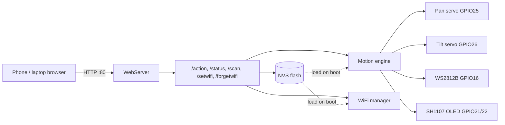
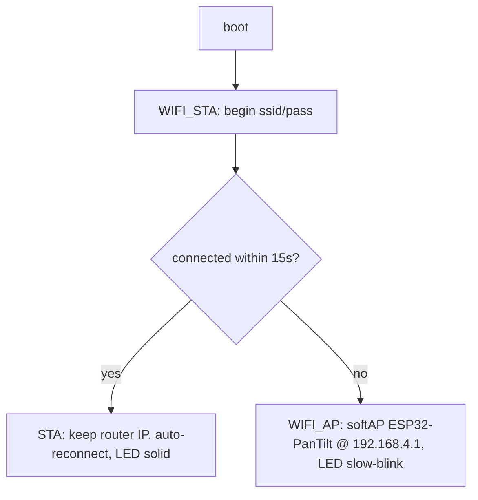

# ESP32 Pan / Tilt — Project Documentation

Complete technical documentation for the firmware, hardware, protocol, and design decisions.
For a quick start see **`README.md`**; for the debugging history see **`lessonlearn.md`**.

- **Target board:** plain ESP32 (WROOM-class, e.g. ESP32-D0WD-V3) — no camera, no PSRAM on 16/17.
- **Toolchain:** Arduino framework, ESP32 Arduino core 3.x, built via PlatformIO (`esp32dev`).
- **Footprint:** Flash ≈ 86 %, RAM ≈ 15 % of the default partition.

---

## 1. Overview

A 2-axis pan/tilt servo rig controllable three ways — a self-contained **web page**, a physical
**I²C joystick** ("cockpit"), and the **HTTP API** — with an OLED display and RGB motion LEDs.
Servos run on a **pluggable backend**: SG90 **PWM** (default) or an **LX-16A serial bus**, and a
**control-target router** can drive either or both. Everything the user configures — WiFi, soft
limits, home, home speed, step size, backend, servo IDs, joystick mode — is saved to flash. The
device joins a WiFi network if it can and otherwise hosts its own hotspot, so it is always reachable.

### Subsystems
| Subsystem | Hardware | Firmware section |
|---|---|---|
| Servo motion | 2× SG90 PWM (GPIO 25/26) **or** LX-16A serial bus (GPIO 17) | backends + router (§5) |
| Physical control | nulllab mini-joystick, I²C **0x5A** | joystick + cockpit (§9a) |
| Persistence | internal NVS flash | §6 |
| Networking | ESP32 WiFi | §7 |
| Web control | 2-tab page (served to a browser) | `web_page.h` (§8) |
| OLED status/cockpit | SH1107 128×128 I²C (GPIO 21/22, **0x3C**) | §9 / §9a |
| Motion LEDs | 4× WS2812B (GPIO 16) | §10 |

---

## 2. System architecture



`loop()` is a single cooperative scheduler — it never blocks. Each pass services the web server,
advances the home glide, updates the LEDs, and (throttled) redraws the OLED. All timing is
`millis()`-based; there are no `delay()` calls in the run loop.

---

## 3. Hardware

### Pin map
| GPIO | Use | Notes |
|---|---|---|
| 25 | Pan servo signal (PWM backend) | LEDC PWM, 50 Hz |
| 26 | Tilt servo signal (PWM backend) | LEDC PWM, 50 Hz |
| 32 | LX-16A serial bus (LX backend) | one-pin half-duplex UART; **web-settable** (NVS `lxpin`) |
| 21 | OLED / joystick SDA | I²C (auto-tries swapped order) |
| 22 | OLED / joystick SCL | I²C |
| 16 | WS2812B DIN | RMT-driven by Adafruit NeoPixel |
| 2 | Onboard status LED | solid/slow/fast = STA/AP/connecting |

The **I²C bus (GPIO 21/22) is shared** by the OLED (**0x3C**) and the nulllab mini-joystick
(**0x5A**). Servos use LEDC (PWM backend) or a half-duplex UART on GPIO 17 (LX-16A backend — only
one backend is active at a time); the WS2812B uses RMT; WiFi uses no GPIO. GPIO 16/17 are free on
WROOM-class parts (they are PSRAM on WROVER — not this board).

### Power
Servos (and the LED strip) draw far more than the ESP32's 3V3 rail can supply. Power their `V+`
from an **external 5 V** source and tie its ground to the ESP32 **GND** (common ground). Only the
signal/data lines connect to the GPIOs. See `README.md` §3 for the full warning.

---

## 4. Firmware structure (`esp32_pan_tilt.ino`)

A single translation unit, organized into commented sections:

| Section | Contents |
|---|---|
| Includes | `WiFi`, `WebServer`, `ESP32Servo`, `Wire`, `U8g2lib`, `Preferences`, `Adafruit_NeoPixel`, `servo_backend.h`, `web_page.h` |
| 3 — Config | all compile-time constants (pins, WiFi, servo range, timing, joystick) |
| 4 — Servo model + backends | `enum Axis`, `panPos`/`tiltPos`, `bknd`/`backend`, `ctrlTarget`, `driveAngle` router, `ctrlSlot[3]` |
| 4.5 — Limits/home/glide/NVS | limit + home + speed globals, `homing`, `Preferences prefs` |
| 5/6 — Server state | `WebServer server(80)`, `apMode`, `ip` |
| 7 — OLED state | `U8G2_SH1107_PIMORONI_128X128_F_HW_I2C oled`, redraw bookkeeping |
| 7b — Cockpit state | `cockMode`, `menuPage`/`menuSel`, `editing`, `joyMode`, `driveIdleSince` |
| 8 — LED state | `Adafruit_NeoPixel leds`, `enum LedAnim`, mood/animation bookkeeping |
| 9 — Telemetry | LX-16A voltage/temp/actual/fault cache |
| Helpers | `setLed`, `getValue` (CSV splitter), `fullStatus` (26-field builder) |
| Persistence | `loadSettings` (read + validate all NVS keys) |
| Motion | `stepToward`, `startHome`, `updateHoming`, `reclampToLimits`, setters, `nudge` |
| WiFi | `connectWiFi` |
| HTTP handlers | `handleRoot/Action/Status/NotFound/Scan/SetWifi/ForgetWifi`, `handleServoScan/ServoId/ServoCfg/SetBackend` |
| OLED / cockpit | `setupOLED`, `oledBar`, `drawInfoPage`, `drawMenuDots`, `drawConfigPage`, `drawDriveHUD`, `drawOLED` |
| Joystick | `miniRead`, `stickStep`, `setupJoystick`, `readJoystick` |
| LED | `animColor`, `dimColor`, `signalMove`, `setupLeds`, `updateLeds` |
| Entry points | `setup`, `loop` |

The `Axis` enum is declared before the first function so the Arduino auto-prototype pass can see it.

---

## 5. Motion engine

State per axis: a live angle (`panPos`/`tiltPos`) and a soft-limit window. Two motion paths:

### Nudge (instant)
`nudge(axis, dir)` applies `dir × stepSize`, honors the `INVERT_*` flag by **negating the delta**
(so the command table stays fixed and a reversed servo is a one-line change), clamps to the axis's
**soft limits**, writes the servo, cancels any home glide, and signals the LEDs/OLED with the
**signed actual movement** (0 if clamped → no animation).

### Home glide (non-blocking)
`B,H` → `startHome()` sets `homing = true`. `updateHoming()` runs every loop pass:

```
stepDeg = homeSpeed * (now - homeLastMs) / 1000
if stepDeg < 1: return               # accumulate sub-degree time; DO NOT advance the base
homeLastMs = now
panPos  = stepToward(panPos,  homePan,  stepDeg)
tiltPos = stepToward(tiltPos, homeTilt, stepDeg)
write servos; set oledDirty; signal LEDs for the moving axis
if both at target: homing = false
```

Both axes step at the same °/s, so the nearer one arrives first. A nudge mid-glide cancels it
(manual override wins). The sub-degree accumulation is what lets low speeds actually move (see
`lessonlearn.md` §7).

### Calibration & consistency
Setters (`setPanMin/Max`, `setTiltMin/Max`, `setHomePan/Tilt`, `setStep`, `setHomeSpeed`,
`captureHome`, `resetCalibration`) each clamp so `min ≤ max` and home stays within limits, persist
their key, and — for limit changes — call `reclampToLimits()`, which pulls the live position and
home inside the new window (writing the servo if needed) **and persists home if it moved**.

### Position presets

Four framing shots per **control target** (D-A2: PWM, Serial and Both each keep their own), stored
in NVS (`ppTN`/`ptTN`, −1 = empty). `P,<R|S|X>,<1-4>` recalls / saves / clears; recall rides the
home-glide engine (`startGlideTo`, clamped to the live soft limits) so it never snaps. Status CSV
fields 36–43 carry the active target's slots, so the web main-page card and the OLED Presets page
(last MENU page: Confirm = recall, A = save) stay in sync automatically.

### Range test with collision watch (user-designed)

`GET /servotest` (web **Test** tab) sweeps ONE servo across the full physical 0–180° at 10 °/s —
soft limits deliberately bypassed (that is the purpose of a range test), which is why every other
motion source (joystick, D-pad, homing, auto-trim) is hard-locked while a test runs or sits halted.
On the LX backend the sweep is **collision-watched** every 500 ms (verified end-to-end on hardware by narrowing the servo's own EEPROM angle limit as a synthetic obstacle — trip at 84°, backoff to 89°, halt, full lockout, clean recovery after restore): if commanded-vs-measured exceeds
8° while the measured angle stops progressing (~1 s), the servo is re-commanded to **measured −5°
against its direction of travel** and the whole system **halts** until `?stop=1`. PWM servos have
no feedback; their sweep runs blind and the UI says so. The cockpit Config page also gained a
**Target** row so the joystick's driven servo set (PWM / SERIAL / BOTH) switches from the stick.

### Servo backends (the `ServoBackend` seam)

Motion is written through an abstract **`ServoBackend`** (in `servo_backend.h`) so the mechanism is
swappable without touching the motion engine:

| Backend | Hardware | Selected when |
|---|---|---|
| `PwmBackend` (default) | 2× SG90 on GPIO 25/26 (LEDC) | `bknd = 0` |
| `Lx16aBackend` | LX-16A smart servos on a one-pin serial bus (`lxpin`, default 32) | `bknd = 1` |

**Stiction auto-trim (user-designed).** An undervolted/loaded LX-16A can land short of its
commanded angle and stall-push (measured: cmd 120 → actual 118 at 5.0 V). The fix is the user's
staircase: after a move settles, `updateLxTrim()` (400 ms cadence, one position read) compares
actual vs target; if ≥2° short it re-commands past the target by the shortfall (≤2 bumps), and on
arrival **learns the total overshoot per axis and per direction** (EMA: grows slowly, shrinks fast;
cap 4°), applying it to the *first* command of future moves. The physical command never strays more
than 6° from the logical target, so soft-limit semantics hold. Trims persist to NVS (`cbu0`/`cbd0`/
`cbu1`/`cbd1`); `GET /lxcal` shows the learned values and the last 10 settle records; `?reset=1`
zeroes them. Landings within ±1° are accepted (integer-degree read resolution).

Two companion behaviors (both the user's design):
- **Accept-reality park:** if the staircase runs out of bumps with ≤2° residual, the firmware adopts
  the servo's *reported* position as the logical position (clamped to the soft-limit window) and
  re-commands **at** it — the internal controller stops leaning on a gap it cannot close, ending the
  stall-push buzz, and the UI shows the true angle.
- **Idle torque release** (`lxRelax`, NVS `lxrelax`, web "Torque when parked", `R,<0|1>`): ~3 s after
  an axis settles, torque is released — fully silent, zero hold current. The next command re-engages
  torque first and moves with a gentler minimum time (the axis may have drifted while limp). While
  released, the stall-fault bit is suppressed for that axis. **Caution:** a released axis does not
  hold against gravity — leave "Hold" for an unbalanced tilt load.

**Bus pin.** `beginOnePinMode()` routes UART RX **and** TX to the same GPIO through the ESP32's
GPIO matrix, so the bus is not tied to a Serial2 default pin — and Serial2's usual RX (GPIO 16, our
WS2812B data line) is never claimed. The pin is NVS-backed (`lxpin`) and changed from the web page
via `GET /setlxpin?pin=<n>`, which validates, persists and reboots. `lxPinReject()` (in
`servo_backend.h`) is the single source of truth for what's usable, rejecting input-only pins
(34–39), SPI-flash pins (6–11), UART0 (1/3), strapping pins (0/2/12/15) and pins this project
already drives — leaving **4, 5, 13, 14, 17, 18, 19, 23, 27, 32, 33**.

`bknd` is persisted; `setBknd()` writes it and **reboots** (a backend switch re-inits hardware, so a
clean boot beats a live swap — same rationale as WiFi provisioning). The LX backend adds bus
telemetry (voltage / temperature / actual-angle / fault — surfaced in the CSV and the OLED Servo Bus
page) and per-servo IDs (`panid` / `tiltid`, settable live via `M,PI|TI`).

> **D1 — fully resolved on hardware (2026-08-09), reads included.** Root cause: `lx16a-servo` flips
> bus direction with `pinMode(pin, OUTPUT|PULLUP)` around every write, and on arduino-esp32 3.x
> `pinMode()` **detaches the pad from the UART peripheral** — so no byte ever reached the wire. The
> library's bus objects are now **removed entirely**; all traffic goes through a **GPIO-matrix
> half-duplex engine** (`lxBusBegin`/`lxRawSend`/`lxRawRead` in `servo_backend.h`): RX stays
> permanently attached to the bus pin, the U2TXD out-signal is matrix-routed to the pad only around
> each packet and released with `gpio_set_direction` — `pinMode` is never called on that pad. Since
> RX hears everything, each send discards its own echo before parsing the servo's checksummed reply.
> **Verified live: motion, bus scan, per-servo config readback, ID programming, and telemetry**
> (vin/temp/actual angle in `/status`). Write-ups: `lessonlearn.md` §20–21.

### Control-target router & independent state

`driveAngle(axis, deg)` fans every motion write to a target chosen by **`ctrlTarget`**:

| `ctrlTarget` | Writes to |
|---|---|
| `0` PWM | `PwmBackend` only |
| `1` LX | `Lx16aBackend` only (when `bknd == 1`) |
| `2` Both | both backends together |

Each target is an **independent controller** (D-A2): it owns its own pan/tilt position *and* its own
config (soft limits, home, home speed, step). The live globals always belong to the **active**
target; `setCtrlTarget()` calls `saveSlot()` on the outgoing target and `loadSlot()` on the incoming
one, so PWM and LX can be aimed at completely different things with different travel windows.
`T,<0|1|2>` sets it live; it is persisted as `ctgt`.

Config is persisted **per target** under suffixed NVS keys (`pmin0`/`pmin1`/`pmin2`, …) built by
`ckey(base, target)`. On the first boot of this firmware the *legacy shared* keys are used as each
target's default, so an existing calibration migrates cleanly instead of appearing to reset.

> **Swap-model trade-off.** Keeping one live copy (rather than the plan's full `Controller` struct)
> leaves every motion function untouched, but means only the **active** target glides: an inactive
> target's home glide is paused and resumes when you switch back to it.

---

## 6. Persistence (NVS via `Preferences`)

Namespace **`pantilt`**, opened read/write once in `setup()`. Keys (≤15 chars):

| Key | Meaning | Key | Meaning |
|---|---|---|---|
| `pmin<t>`/`pmax<t>` | pan limits (per target) | `hpan<t>`/`htilt<t>` | home angles (per target) |
| `tmin<t>`/`tmax<t>` | tilt limits (per target) | `hspd<t>` | home speed (per target) |
| `step<t>` | step size (per target) | `wssid`/`wpass` | provisioned WiFi creds |
| `bknd` | servo backend (0 PWM / 1 LX) | `ctgt` | control target (0/1/2) |
| `panid`/`tiltid` | LX-16A servo IDs | `joyen` | joystick enable (0/1) |
| `joymd` | joystick mode (0 RATE / 1 ABS) | `kbhm`/`kbbk`/`kben`/`kbtg` | button remap (index 0–4) |
| `lxpin` | LX-16A bus GPIO (applied at boot) | `ppin`/`tpin` | PWM pan/tilt GPIOs (applied at boot) |

`<t>` is the control-target digit (0 = PWM, 1 = LX, 2 = Both) — see §5. The un-suffixed `pmin`,
`step`, … keys are the pre-per-target **legacy** values, still read once as the migration default.

`loadSettings()` reads each with a default, then **validates**: clamp to 0–180, swap if `min > max`,
pull home inside limits, clamp speed/step to range, and range-check the backend/target/ID/joystick
keys. This makes a corrupt or hostile NVS blob unable to produce an illegal runtime state. Config
changes write a single key immediately (user-paced; NVS wear-levels).

---

## 7. WiFi subsystem

**mDNS + OTA.** The device registers `pantilt.local` (mDNS, STA and AP alike; DHCP hostname
`pantilt`). Wireless flashing has two paths, both password-gated with `AP_PASS` and both stopping
any range test/glide first: ArduinoOTA (`pio run -e esp32ota -t upload`) and a **browser upload**
(`POST /update?pw=…`, System tab → Firmware update) that streams the multipart `.bin` into the
spare OTA slot via `Update.h` and reboots onto it. Verified: a wrong password is rejected with
nothing written; a correct upload of the full image flashed, rebooted, and preserved all settings. The partition
table is `min_spiffs` (two 1.9 MB OTA app slots; NVS/otadata/app0 offsets match the default table,
so stored settings survived the switch — verified).


### Boot decision
`connectWiFi()` loads creds (provisioned `wssid`/`wpass` if present, else the compiled placeholders)
and tries **Station** mode for `WIFI_STA_TIMEOUT_MS` (15 s, LED fast-blink).



The AP fallback is **pure `WIFI_AP`** (one radio, stable broadcast). It is *not* `WIFI_AP_STA` —
that breaks the hotspot (see `lessonlearn.md` §5).

### Provisioning
- `GET /scan` — if in AP mode, momentarily switch to `WIFI_AP_STA`, run `WiFi.scanNetworks()`,
  then restore `WIFI_AP`. Returns `ssid⇥rssi⇥locked` per line (TAB-delimited; SSIDs may contain
  commas). The scan briefly disrupts the hotspot; the response is delivered once the radio returns.
- `GET /setwifi?ssid=..&pass=..` — write creds to NVS, reply `saved`, `delay(400)` to flush, then
  `ESP.restart()`. On reboot the STA-first path joins the new network.
- `GET /forgetwifi` — clear `wssid`/`wpass`, reboot (→ placeholders → hotspot).

> Security note: WiFi credentials are stored in NVS in plaintext and travel over HTTP on the local
> AP. Acceptable for a hobby LAN device; do not expose the page to untrusted networks.

---

## 8. Web control page (`web_page.h`)

A single `PROGMEM` string served by `handleRoot()` with `server.send_P`. **Fully self-contained** —
inline CSS/JS, `data:` favicon, no external resource of any kind (it must work in AP mode with no
internet).

### Structure
- Always visible: title, **badge** (mode · IP — also the advanced toggle), control-target tabs
  (PWM · Serial · Both), Pan/Tilt readout, D-pad, Speed/Step slider.
- **Advanced** (hidden; revealed by tapping the badge) is organized into **config tabs**, one
  group visible at a time:
  | Tab | Cards |
  |---|---|
  | **Rig** (default) | Soft limits · Home · Reset calibration |
  | **Serial** (LX only) | sub-tabs: **Main** (telemetry + torque-when-parked) · **IDs** (Bus scan · Link servo IDs · Program servo ID) · **Detail** (full register editor, servo picked from a **dropdown** fed by scans + the linked IDs) |
  | **Digital** | PWM (SG90) servo **GPIO pickers** for pan/tilt — dropdowns hide pins already used by the LX bus, I2C, LEDs, or the other servo; firmware re-validates and reboots onto the new pins |
  | **Joystick** | enable · drive mode · button remap |
  | **System** | Servo backend (+ bus pin) · WiFi setup |

### Behaviors
- **D-pad:** Pointer Events with press-and-hold auto-repeat (~120 ms). The repeat interval is
  cleared on `pointerup/leave/cancel`, window `blur`, and tab `visibilitychange` (never sticks);
  `keydown` (Enter/Space) makes the pads keyboard-operable.
- **`send(cmd)`** → `GET /action?go=…`; the reply is the 26-field CSV.
- **`applyState(csv)`** — the single parser for `/action` replies **and** the ~700 ms `/status`
  poll. It updates the readout, badge, sliders, and every limit/home field, and shows a "homing…"
  hint. It **skips any control that currently has focus**, so polling never clobbers a value the
  user is editing.
- **In-flight guard:** a `busy` flag throttles the auto-repeat to the link RTT and pauses the poll,
  preventing a request backlog that would over-run the servos on a slow link.
- **WiFi setup:** Scan → populate a `<select>` → password → **Save & join** (`/setwifi`, then the
  device reboots) / **Forget** (`/forgetwifi`).

---

## 9. OLED subsystem (SH1107 128×128)

Driver: **`U8G2_SH1107_PIMORONI_128X128_F_HW_I2C`** (column offset 0 — see `lessonlearn.md` §3).
`setupOLED()` probes 0x3C then 0x3D on the configured pins, then on the swapped pins, and degrades
gracefully (logs and runs on) if nothing answers. Redraws are `oledDirty`-driven and throttled to
`OLED_DRAW_MS` (150 ms) so a full-frame I²C push never hogs the loop.

### Screens — the cockpit

The OLED is no longer an auto-cycling status display; it is a two-mode **cockpit** driven by the
joystick (§9a). `drawOLED()` clears the buffer and dispatches on `cockMode`:

- **DRIVE** — a live HUD (big Pan/Tilt numbers + soft-limit/home bars, like the old Position page)
  while the stick flies the active target; the header shows the joystick mode (`RATE` / `ABS`).
- **MENU** — a carousel navigated with the stick, bottom dots tracking the page:
  **Config** (editable) · **Position** · **Calibration** · **Connection** · **Servo Bus** (LX only) ·
  **Servo** (LX only, editable). The **Config** page edits **Speed / Joy mode / Step** in place; the
  **Servo** page (D-F) picks PAN/TILT and edits that servo's **angle-limit min/max** (ticks 0–1000)
  and **torque**, writing straight to the LX-16A. On both, the selected row is highlighted
  (inverted) and its value **blinks** while editing.

The Servo page's bus read is **cached and throttled** (≥1.5 s, only while that page is on screen and
the rig is idle) because each refresh is ~10 bus transactions; every field it can't read renders as
`--` rather than a fabricated value, and an edit is refused outright until one read has succeeded.

The Servo page covers the **full LX-16A register set** (parity with the SpaceMaster85 and
maximkulkin/lewansoul-lx16a tools) in a scrollable 14-item list: Servo (PAN/TILT), **Bus ID**
(axis→servo link — *not* servo reprogramming, which stays web-only behind `/servoid`'s
confirm+verify), angle-limit min/max, **Trim** (RAM) + **Trim save** (action row: Confirm executes
the EEPROM persist), voltage-limit min/max, temp cap, Torque, LED (register is inverted; shown as
ON/OFF), Alarm mask (0–7), and **Mode** (SERVO⇄MOTOR — always switched at speed 0 so a rig servo
can never start spinning) + motor Speed. The Servo Bus page's Confirm triggers a **bus rescan**
(IDs 1–12, ~150 ms) and lists the responders inline.

DRIVE auto-returns to MENU after **5 s** of stick inactivity. The old 3 s auto-cycle and the
"Moving" arrow screen were replaced by this cockpit; redraws stay `oledDirty`-driven and throttled
to `OLED_DRAW_MS` (150 ms), with a steady refresh so the HUD/menu track live state.

**Button feedback (`hintBar`).** Every page ends in a hint bar listing its live buttons (names
follow the remap). When a mapped button click is dispatched, its hint flashes **inverted** (white
box, black text) for ~400 ms — a visible acknowledgment on every page, even when the action's
effect isn't obvious. Info pages show the generic `L/R page · D fly` bar; Config/Servo show their
edit flow; Servo Bus shows `scan/rescan` plus the found-ID list.

---

## 9a. Joystick & cockpit (nulllab mini @ 0x5A)

A **nulllab mini-joystick** on the shared I²C bus is the physical controller. It is a raw *register*
device (not a seesaw); `readJoystick()` reads it through a `miniRead(reg)` helper whose handshake is
**write-register → STOP → `requestFrom`** (a repeated-start returns garbage — `lessonlearn.md` §12).

### Register map
| Data | Register | Encoding |
|---|---|---|
| X / Y axis | `0x10` / `0x11` | 0–255, centre 128 |
| Buttons OK / C / A / B / D | `0x20` / `0x21` / `0x22` / `0x23` / `0x24` | event: `0` down · `3` single-click · `6` long-hold · `8` idle |

### Cockpit controls
The stick's centre-click (**OK**) is stiff and nudges the stick when pressed, so the **defaults**
avoid it entirely:

| Input | DRIVE | MENU |
|---|---|---|
| Stick | fly pan/tilt | U/D = item · L/R = page |
| **C** | — | confirm / edit |
| **D** | → MENU | → DRIVE |
| **A** | home | — |
| **B** | — | back / cancel edit |

**Remapping (D-B).** Each of the four actions stores a button **index** (`0–4` = A/B/C/D/OK) in NVS
(`kbhm`/`kbbk`/`kben`/`kbtg`); `readJoystick()` reads all five buttons and dispatches through the
map, and the OLED footer hints render the mapped names. Remapping is deliberately **web-only**
(`K,<HM|BK|EN|TG>,<0-4>`) — the stick can never rebind itself, so a bad map can't lock you out of
the on-device menu that would fix it. Duplicate assignments are allowed but flagged by the web page.

MENU navigation is edge-triggered with a 300 ms key-repeat (`stickStep()`); every Config change
persists immediately via the normal setters.

### Joystick modes (`joyMode`, persisted as `joymd`)
- **RATE** (0, default) — proportional-rate jog: larger deflection → faster nudges (interval mapped
  `JOY_SLOW_MS` → `JOY_FAST_MS`), through the same `nudge()` / router path.
- **ABSOLUTE** (1) — stick position maps to an absolute pan/tilt target and the rig **glides** there
  (never snaps), at ~`homeSpeed`.

`joyEnabled` (`joyen`) gates all joystick input. Mode is set from the OLED Config page; enable is
also exposed over HTTP (`J,<0|1>`). Per-button remap is a planned **web-only** feature.

---

## 10. WS2812B subsystem (4 corner LEDs)

Corner order (strip index): `0 = TR, 1 = TL, 2 = BL, 3 = BR`. Brightness is baked into the color
values (global `setBrightness(255)`), so idle and motion brightness coexist.

- **Idle — mood light:** every `MOOD_FRAME_MS`, a slow-drifting rainbow (`ColorHSV`, gamma-corrected)
  at `MOOD_VAL` (~30 %), each corner ¼-wheel apart (~25 s per full cycle).
- **Moving — direction animation:** `signalMove()` (called from `nudge`/`updateHoming` with the
  signed movement) selects a `LedAnim`, and `updateLeds()` renders it in a per-direction color:

| `LedAnim` | Trigger | Color | Pattern |
|---|---|---|---|
| `LED_PAN_CW` | pan angle ↑ | blue | comet, clockwise |
| `LED_PAN_CCW` | pan angle ↓ | magenta | comet, anti-clockwise |
| `LED_TILT_UP` | tilt angle ↑ | green | bar, bottom→top |
| `LED_TILT_DOWN` | tilt angle ↓ | amber | bar, top→bottom |

Motion lingers `LED_HOLD_MS` (300 ms) after the last move, then falls back to the mood light. The
`ledAnim`/`ledActiveUntil` state drives the corner LEDs; the OLED now shows the cockpit **DRIVE HUD**
(§9) rather than a separate "Moving" screen.

---

## 11. HTTP protocol (complete)

`GET /action?go=<cmd>` and `GET /status` both reply with the **31-field CSV**; `/scan`, `/setwifi`,
`/forgetwifi` provision WiFi; `/servoscan`, `/servoid`, `/servocfg`, `/setbackend` manage the LX-16A
backend. Full command table and reply format are in `README.md` §9. Field order:

```
0 mode    1 ip       2 pan      3 tilt     4 step
5 panMin  6 panMax   7 tiltMin  8 tiltMax
9 homePan 10 homeTilt 11 homeSpeed 12 homing(1/0)
13 bknd   14 panid   15 tiltid                                          (backend + LX IDs)
16 panVin 17 panTemp 18 tiltVin 19 tiltTemp 20 panActual 21 tiltActual 22 fault   (LX telemetry; -1 = n/a)
23 ctrlTarget(0/1/2)  24 joystickPresent(1/0)  25 joystickEnabled(1/0)  26 joyMode(0 RATE/1 ABS)
27 mapHome  28 mapBack  29 mapEnter  30 mapToggle                       (button remap, 0-4 = A/B/C/D/OK)
31 lxpin  32 lxRelax  33 pwmPanPin  34 pwmTiltPin
```

Fields 2–11 reflect the **active target's** config (§5), so switching tabs re-populates the page.

Command groups: `B,*` (buttons), `S,<n>` (step), `V,<n>` (home speed), `C,*` (capture / reset),
`N,*,<v>` (numeric setters), `M,PI|TI,<id>` (LX-16A servo IDs), `T,<0|1|2>` (control target),
`J,<0|1>` (joystick enable), `Y,<0|1>` (joystick mode), `K,<HM|BK|EN|TG>,<0-4>` (button remap).
All numeric inputs are clamped server-side regardless of the client.

---

## 12. Build, flash & verify

- **Build:** `pio run` (or Arduino IDE, Board = "ESP32 Dev Module").
- **Flash:** `pio run -t upload --upload-port COMx`.
- **Build flag:** `-Wmissing-field-initializers` is enabled in `platformio.ini`. The codebase is
  clean under it, so any hit is a real defect — it catches short aggregate-inits that silently
  zero struct members after a struct gains fields (`lessonlearn.md` §18).

> **Flash headroom.** The app is at **≈86.7 %** of the default 1.31 MB app partition (~174 kB left)
> and each feature has been adding ~1–5 kB. When it approaches the ceiling, switch partition scheme
> rather than cutting features — add `board_build.partitions = huge_app.csv` to `platformio.ini`
> (≈3 MB app, no OTA). Note the WS2812B/U8g2/WiFi stacks dominate; the web page is only ~20 kB.
- **Serial:** `pio device monitor` @ 115200 — prints OLED detection, `Servos attached: pan=1 tilt=1`,
  and the final WiFi mode + IP.
- **Verification used during development:** PlatformIO compile (hard evidence of correctness),
  hash-verified uploads, serial probes (`OLED OK at 0x3C`, servo attach state), and a host-side
  `netsh wlan show networks` to confirm the hotspot broadcasts.

---

## 13. Design decisions & rationale

| Decision | Why |
|---|---|
| Plain ESP32, no camera | request put servos on 25/26, which are camera pins on an ESP32-CAM |
| `WebServer.h` (not the camera httpd) | simpler, idiomatic, no second server / stream |
| Instant nudges + non-blocking home glide | responsive manual control, smooth adjustable homing |
| Soft limits as clamp bounds | one concept protects both nudges and the home target |
| Unified 26-field CSV (append-only) | one parser on the client; new fields never break old clients |
| Pure `WIFI_AP` + scan-only STA | single radio; a hopping station kills the hotspot |
| Provision → NVS → reboot | robust network switch; deterministic boot; no lockout |
| PIMORONI SH1107 variant | matches this panel's 0xD3 = 0 column offset |
| Brightness in color values | idle mood (30 %) and motion colors coexist without global rescale |
| One motion state for LEDs + OLED | direction is computed once, consumed three ways |
| `ServoBackend` abstraction | swap SG90 PWM ↔ LX-16A serial without touching the motion engine |
| Control-target router + per-target state | PWM and LX can drive different things from one rig |
| Backend switch = reboot | re-init hardware cleanly (same rationale as WiFi provisioning) |
| Joystick cockpit (DRIVE / MENU) | full control with no phone; the OLED becomes interactive |
| Stick-click (OK) unused; C/D on real buttons | the centre-click is ergonomically poor (lessonlearn §15) |
| RATE + ABSOLUTE joystick modes | proportional jog for framing; glide-to-position for repeatable moves |

### Out of scope (YAGNI)
Camera/video, position presets/sequences, motion recording, OTA updates, authentication.

---

## 14. Appendix — key constants

See `README.md` §10 for the full table. Highlights: `PIN_PAN/TILT = 25/26`,
`PIN_OLED_SDA/SCL = 21/22`, `PIN_LEDS = 16`, `NUM_LEDS = 4`, `SERVO_MIN/MAX_US = 500/2500`,
`HOME_DEG = 90`, `WIFI_STA_TIMEOUT_MS = 15000`, home speed 10–300 °/s, step 1–30°,
`MOOD_VAL = 76`.

---

*Related documents: `README.md` (quick start), `lessonlearn.md` (debugging journey),
`docs/superpowers/specs/` (original v1 + v2 design specs).*
